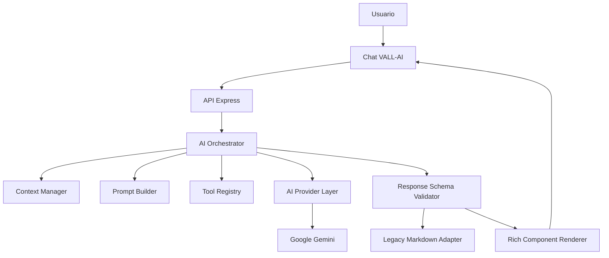

# Arquitectura de respuestas VALL-AI

## Diagnóstico inicial

Antes de esta mejora, las llamadas principales estaban en `backend/routes/chat.js`, el proveedor Gemini en `backend/lib/gemini.js` y el prompt extenso dentro de `assets/js/chat-widget.js`. El navegador enviaba el prompt de sistema, el historial y el contexto como una sola cadena. El backend devolvía texto o eventos SSE sin esquema. El cliente aplicaba un renderer Markdown ligero y soporte especial para bloques `chart`.

Problemas principales:

- El frontend controlaba instrucciones que corresponden al backend.
- No existía una capa de proveedor ni un orquestador reutilizable.
- La respuesta no tenía contrato, versión ni validación de componentes.
- Mermaid, código multilínea, alertas y documentos no tenían componentes propios.
- Los errores del proveedor no estaban normalizados.
- El contexto dinámico se mezclaba con instrucciones privilegiadas.

## Arquitectura implementada



## Archivos principales

- `backend/ai/orchestrator.js`: coordina proveedor, prompt, contexto y respuesta.
- `backend/ai/providers/gemini-provider.js`: abstrae el SDK `@google/genai` y normaliza errores.
- `backend/ai/prompt-builder.js`: prompt de sistema, detección de modo y tipo de tarea.
- `backend/ai/domain-policy.js`: limita VALL-AI al dominio económico y empresarial antes de consumir al proveedor.
- `backend/ai/context-manager.js`: separa contexto dinámico no confiable.
- `backend/ai/tool-registry.js`: contrato para herramientas futuras.
- `backend/ai/response-schema.js`: sanitización, validación, parser y fallback.
- `backend/ai/rich-response.schema.json`: contrato JSON versionado.
- `assets/js/chat-widget.js`: selector de modo y renderer de componentes.
- `assets/js/vendor/mermaid.min.js`: renderizador Mermaid local.

## Contrato

```json
{
  "type": "rich_response",
  "version": "1.0",
  "title": "Arquitectura recomendada",
  "summary": "Resumen ejecutivo",
  "mode": "technical",
  "blocks": [
    { "type": "markdown", "content": "Explicación" },
    { "type": "diagram", "format": "mermaid", "content": "flowchart TD\nA-->B" },
    { "type": "table", "headers": ["Componente", "Función"], "rows": [["API", "Orquestar"]] },
    { "type": "code", "language": "javascript", "filename": "server.js", "content": "..." }
  ],
  "markdown": "Fallback compatible",
  "meta": {
    "provider": "gemini",
    "model": "gemini-2.5-flash",
    "taskType": "technical",
    "generatedAt": "2026-07-22T00:00:00.000Z",
    "latencyMs": 1200,
    "warnings": []
  }
}
```

## Compatibilidad y migración

`POST /api/chat` conserva `reply` y añade `response`. `POST /api/ai-insight-stream` mantiene el protocolo anterior cuando `structured` no es `true`. El chat nuevo envía `structured: true`, recibe texto progresivo y al finalizar reemplaza el contenido por bloques validados. Conversaciones antiguas sin `rich` siguen usando Markdown.

## Seguridad

- El prompt del sistema vive en el backend.
- Las consultas de programación y temas ajenos se redirigen localmente sin enviarse al modelo.
- El contexto de página, historial y herramientas se etiqueta como datos no confiables.
- Mermaid rechaza enlaces, clicks, JavaScript y HTML ejecutable.
- URLs de imágenes se limitan a HTTP(S) o rutas locales.
- El renderer usa `textContent` para código, tablas y campos estructurados.
- Los errores del proveedor se convierten en mensajes públicos sin filtrar detalles internos.

## Rendimiento

- Una sola llamada al modelo por respuesta.
- SSE conserva renderizado progresivo.
- La validación es local y lineal respecto al tamaño de la respuesta.
- Mermaid se carga de forma diferida solo cuando existe un diagrama.
- Chart.js conserva su carga diferida y sus límites de series y puntos.

## Pruebas

Ejecutar:

```powershell
node scripts/test-ai-response.cjs
npm run build
```

También se recomienda probar manualmente los cinco modos, respuestas canceladas, regeneración, tablas anchas, Mermaid inválido, gráfica sin datos y compatibilidad de conversaciones guardadas.
